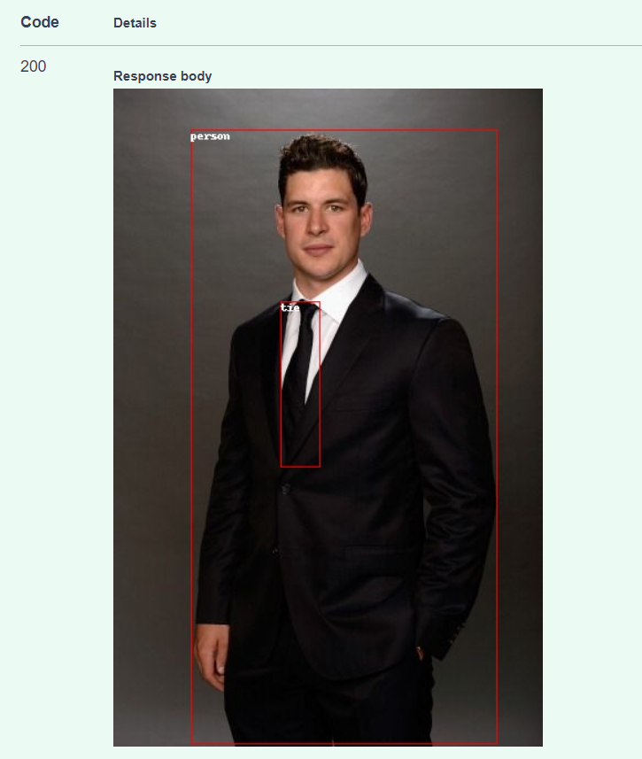
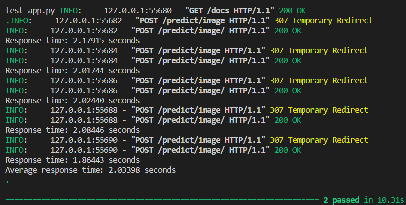

## **Детекция объектов на MS-COCO с помощью DETR**
----------------------------------------------------------------------------------------------------------------

Файлы: 
- `scripts/val_data_generation.py` - создание датасета для валидации с помощью COCOAPI по файлу с аннотациями
- `notebooks/inference.ipynb` - Ноутбук содержит инференс модели
- `notebooks/Training.ipynb` - Процесс обучения модели
- `app/models/DERT_object_detection.py` - Класс с инициализацией модели и прогнозом
- `app/main.py` - FastAPI app
- `app/test_app.py` - Тесты для проверки работоспособности и замера среднего времени выполнения программы

Для обучения модели использовалась предобученная модель https://huggingface.co/facebook/detr-resnet-50. Обучение было на одной эпохе. Для обучения использовалась платформа pytorch.lightning и для визуализации процедуры обучения использовался tensorboard (см. https://huggingface.co/Batr97/DETR_coco/tensorboard)
В качестве датасета для обучения был взят датасет из https://huggingface.co/datasets/detection-datasets/coco. 

Для валидации использовались данные, скаченные с https://cocodataset.org/#download. В `scripts/val_data_generation.py` с помощью COCOAPI загружались изображения по файлу с аннотациями.

Для экономии места можно использовать COCOAPI и скачивать изображения, соответствующие определенным категориям из файла с аннотациями.

На FastAPI отправляются запросы по детекции загруженного изображения в формате .jpg, .png в endpoint predict/image, результатом является картинка с найденными объектами:



Были выполнены тесты на проверку работоспособности сервиса и замера среднего времени выполнения запросов (составил 2 сек)



Используется докер образ для запуска сервиса, чтобы его запустить необходимо использовать команду: 
```
docker build -t object_detection:latest .
```

Далее, для того чтобы запустить контейнер, необходимо ввести команду: 
```
docker run -p 7329:8000  --network host -it object_detection:latest bash
```

Для поднятия сервиса внутри контейнера запустить команду:
```
python -m uvicorn main:app --host 0.0.0.0 --port 8000
```
